## Cashiers in the Shop
 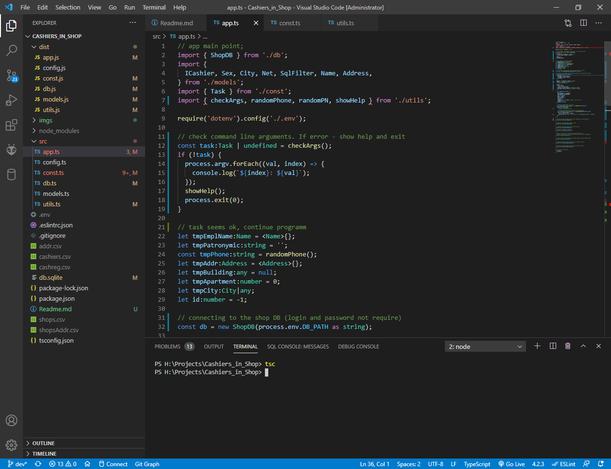

## Description
This is a Typescript project for the solution of the "Node.js (TS) Internship - Test task 4" from ChatBotStudio>_

## Usage
1. Copy project
2. Install all dependencies
3. Compille by the command 
``` cmd  
   tsc 
```
4. Run with a command 
  ``` cmd
   node .\dist\app.js 
  ```
  and use option keys:
  ``` cmd
  --cashierCreate lastName firstName city street building apartment

  --getCashierById id
  
  --cashierUpdate id patronymic building apartment
  
   --cashierDelete id
  
   --useFilter1
  
   --useFilter2
  
   --getAllCashiers
  
   --getTargetCashiers1
  
   --getTargetCashiers2
```

_Command Examples:_
``` cmd
--cashierCreate Шевченко Валерия Полтава 'ул. Соборности' 14 31

--getCashierById 1

--cashierUpdate 60 Сергеевна 16 19

--cashierDelete 57
```

## ScreenShorts
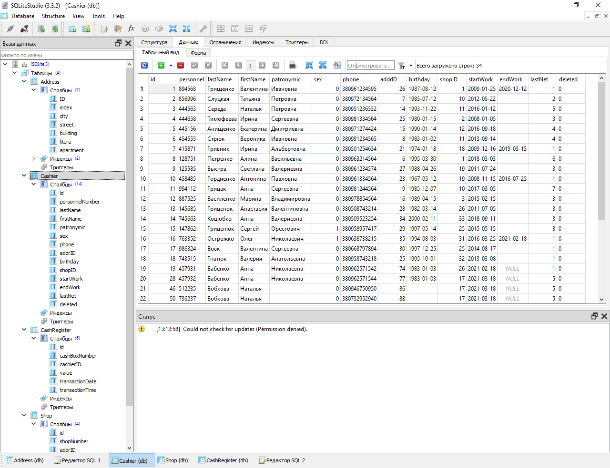
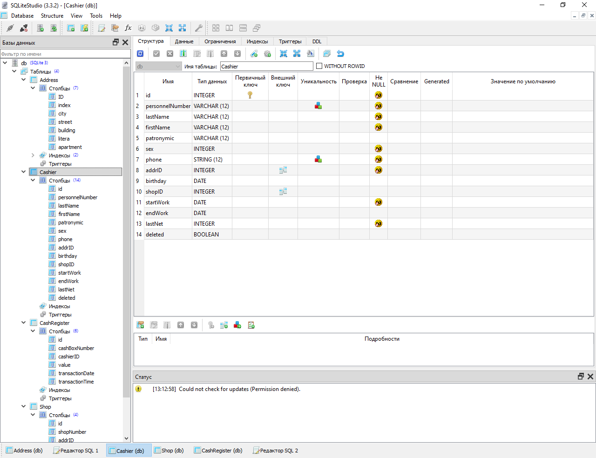
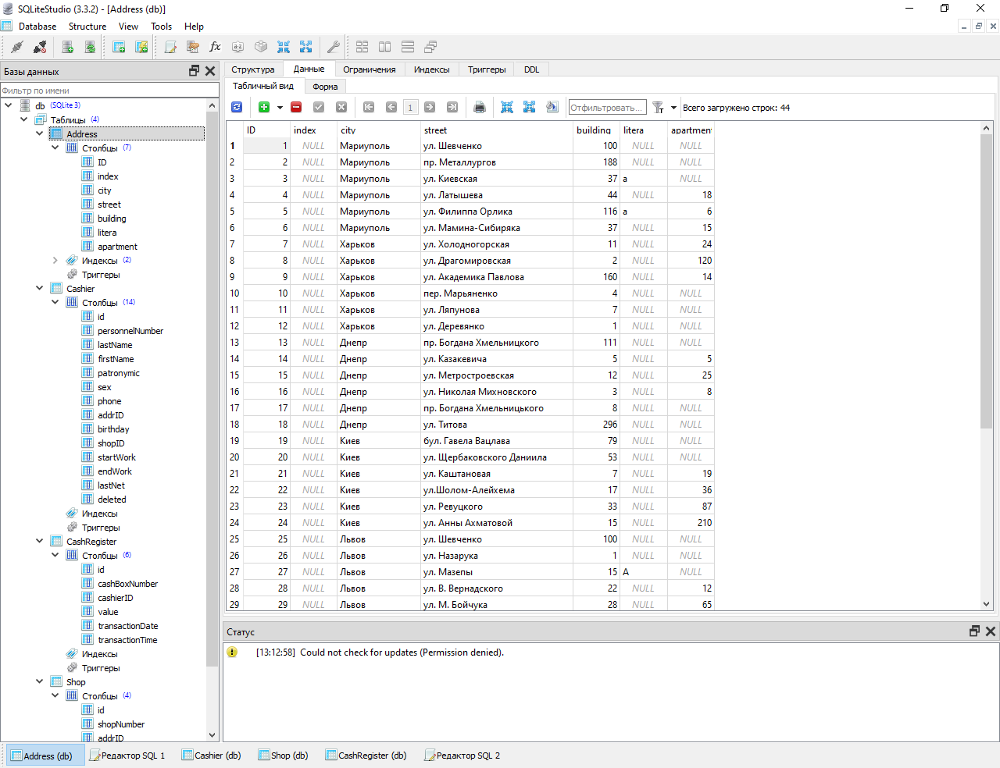
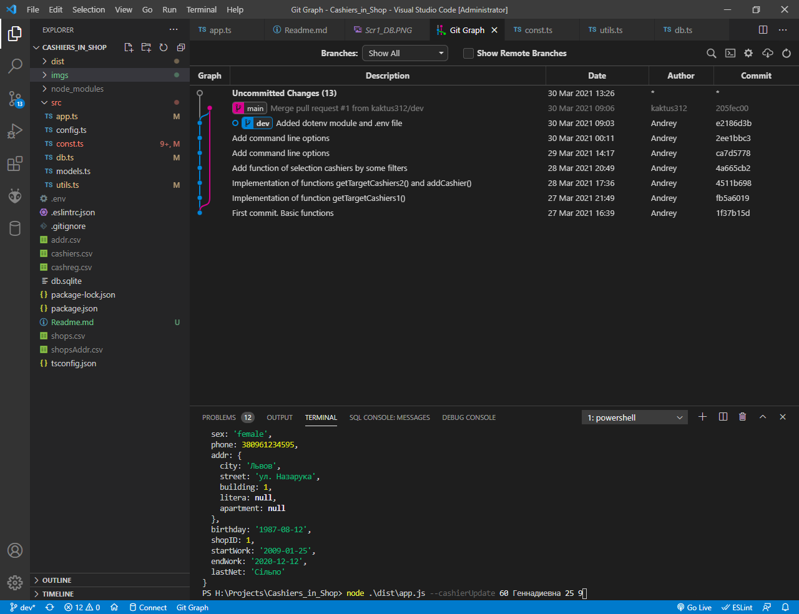

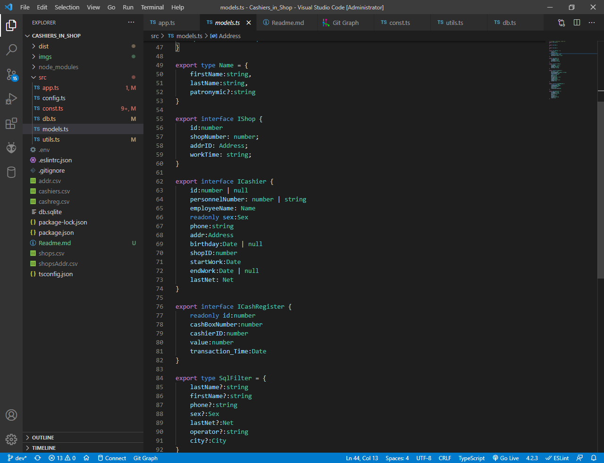
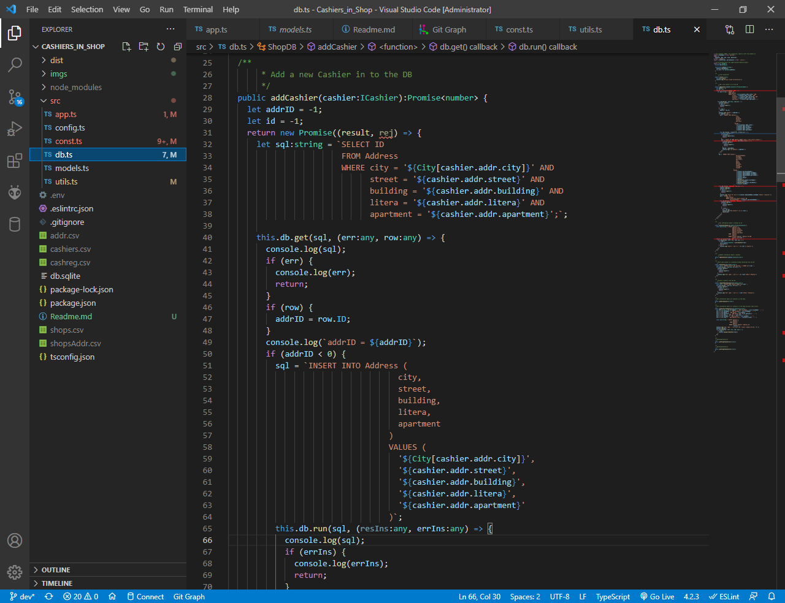
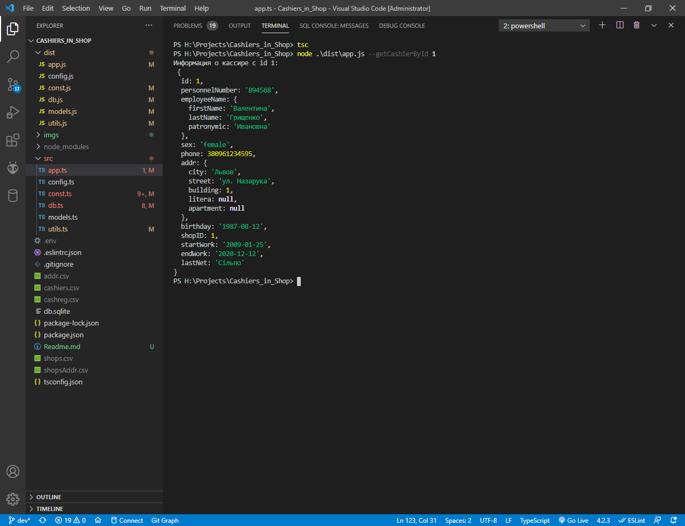
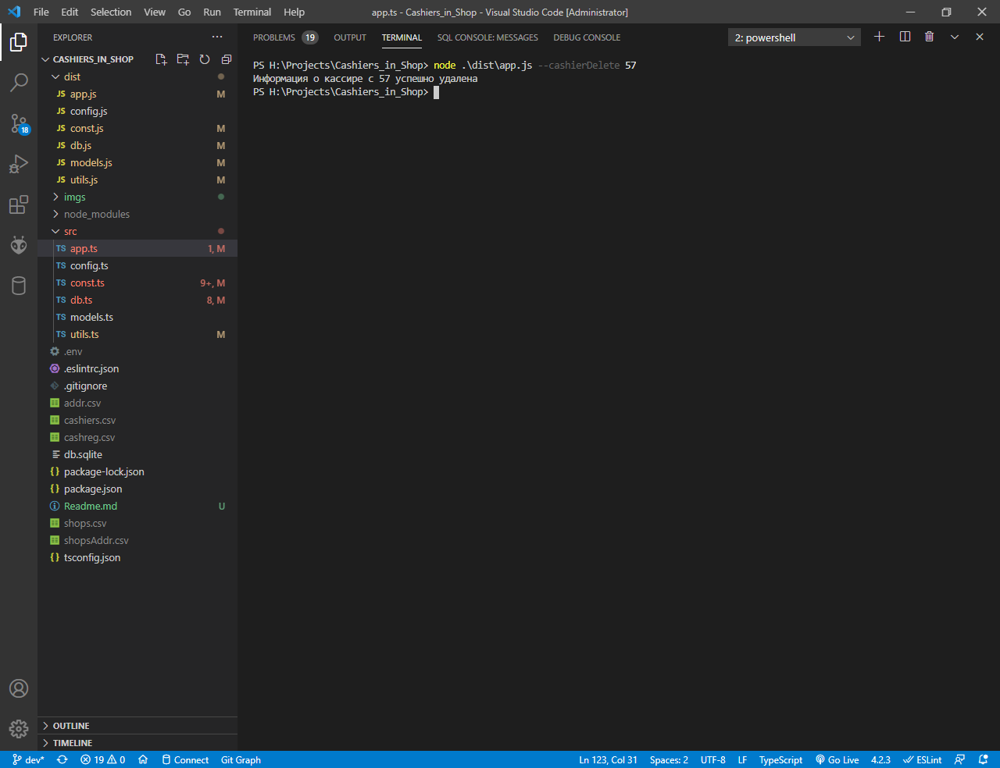
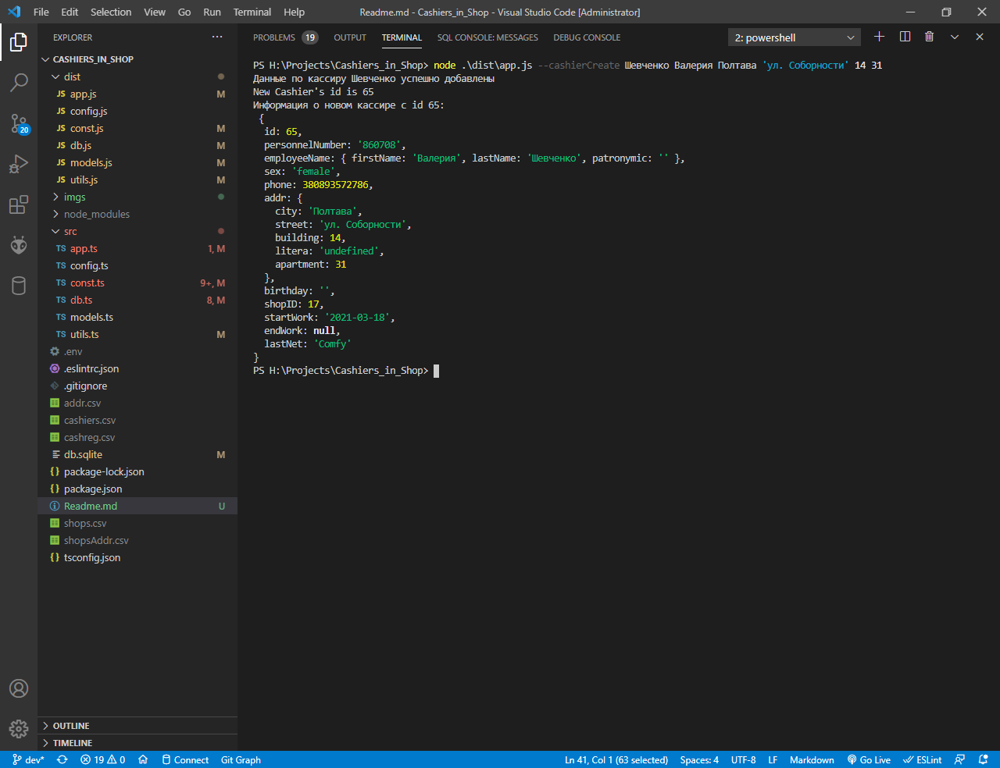
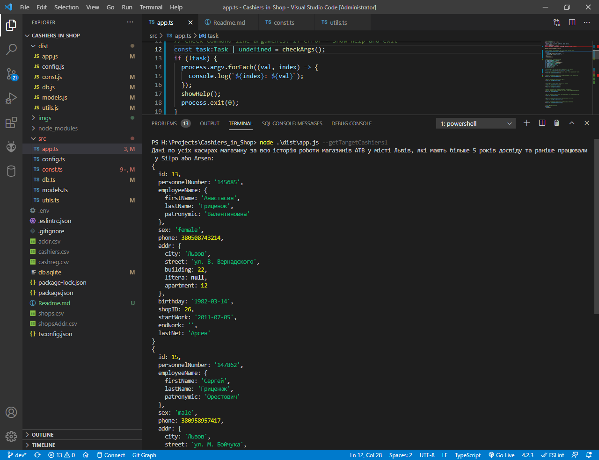
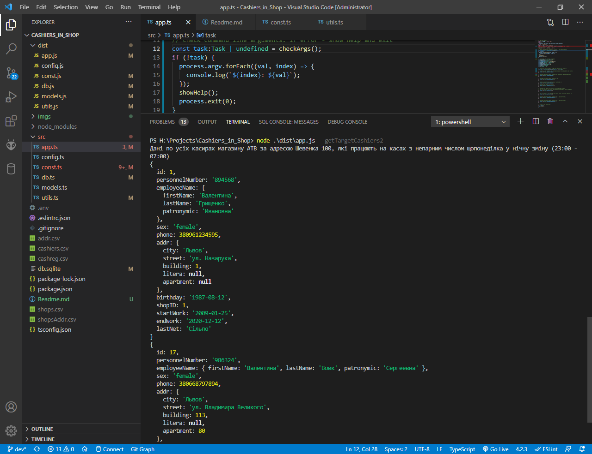